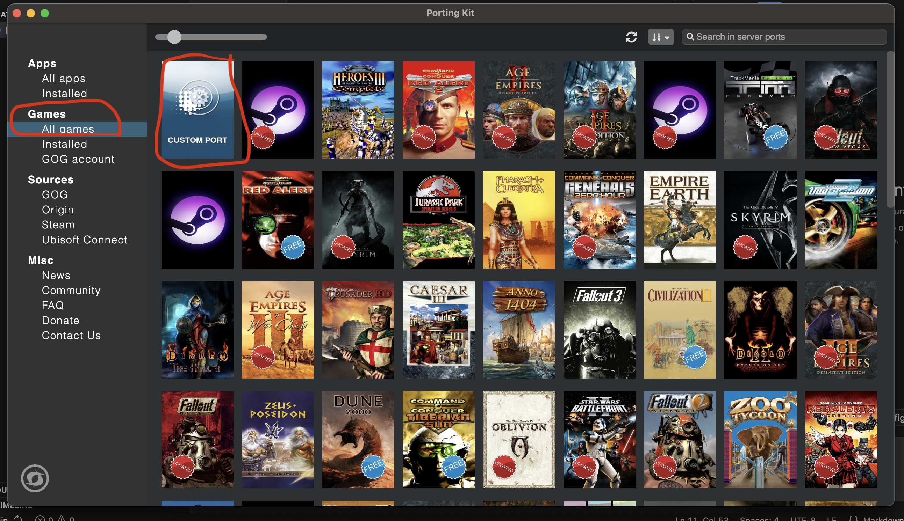
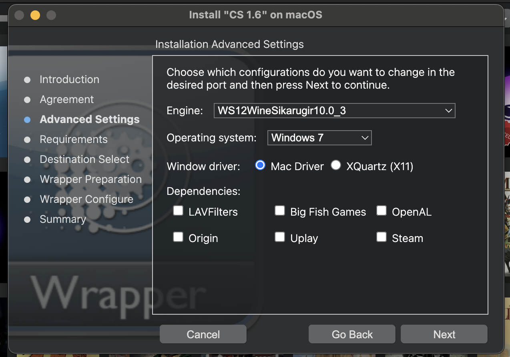
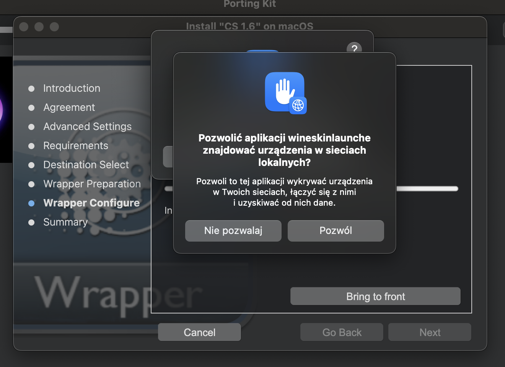
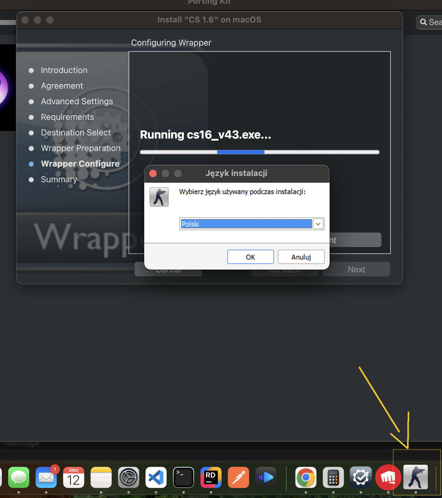
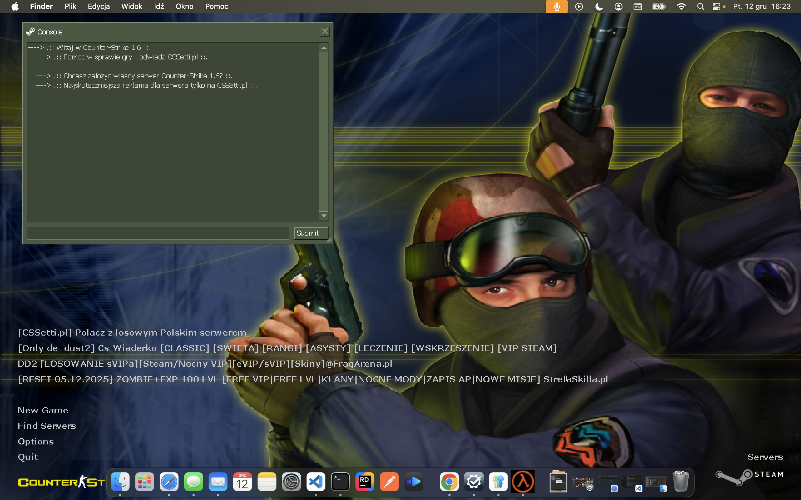
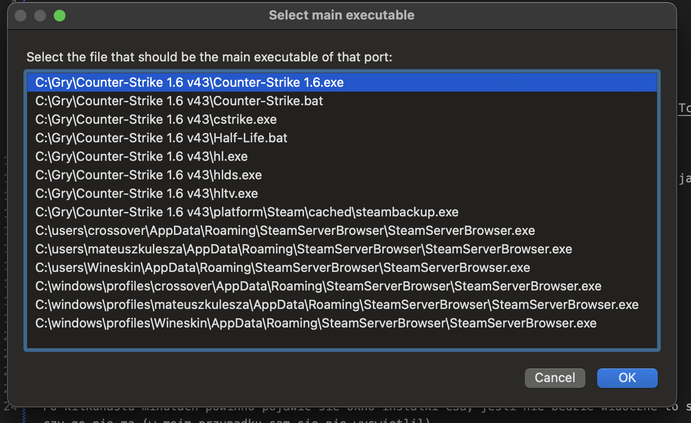
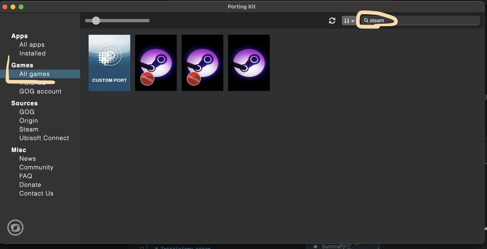

# Instalujemy PortingKit
ściągamy stąd https://www.portingkit.com/download
Jeśli mamy Laptop z procesorem M (M1, M2, M3 itd) to ściągamy wersje ARM64, w przeciwnym wypadku INTEL

# Sciagamy CS 1.6
https://cssetti.pl/download

Niby bez wirusow (skan tutaj https://www.virustotal.com/gui/file/e111990cce258fdfd642c1a7733fb95ff3efe431074794811042019c33f8e7d9?fbclid=IwY2xjawOpCQlleHRuA2FlbQIxMABicmlkETAwY21MQ3NpSG9ERUtCbUN1c3J0YwZhcHBfaWQQMjIyMDM5MTc4ODIwMDg5MgABHsbhlPDZzgCuXP87RBuEgm-fz04-7JRNxFW1g-UChIYK2NoYcP7QaAqcx8gO_aem_IG2Bq_X2UT6coQtuRhcbMQ)

# Instalujemy CS 1.6
W PortingKit po lewej stronie "Games" -> "All Games", wybieramy "Custom port",nazywamy go jak chcemy

Ustawienia:
Engine: WS12WineSikarugir10.0_3
Operating System: Windows 7

W trakcie instalacji poprosi nas o wskazanie instalki z CS

Pojawi sie komunikat czy zezwalamy Wineskin na znajdowanie urzadzen w sieci - Pozwól

Po kilkunastu minutach powinno pojawic sie okno instalki CSa, jesli nie bedzie widoczne to sprawdzcie w pasku aplikacji czy go nie ma (w moim przypadku sam sie nie wyswietlil)

Odpalamy gre, wychodzimy z niej, czekamy az instalator sie zakonczy

Pojawi sie okno "Select main executable", wybieramy Counter strike 1.6.exe

# Instalujemy steam
Games -> All Games -> szukamy "steam"

Wybieramy wersje Steambuild 32/64bit **Direct3D**

